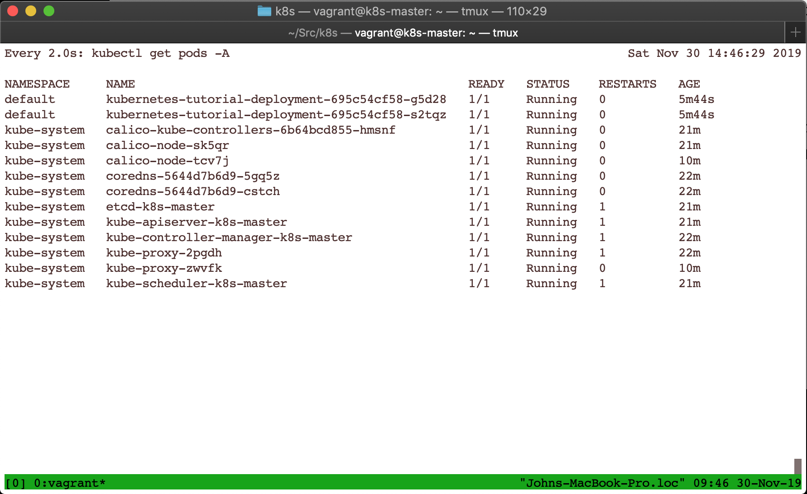

# Kubernetes in Virtual Machines - Cilium Overlay Network Project

This repository provides a set of files that allows the deployment of a kubernetes cluster formed by VirtualBox vms.
The information used to create these files was retrieved from this [blog post](https://kubernetes.io/blog/2019/03/15/kubernetes-setup-using-ansible-and-vagrant/) written by Naresh L J (Infosys).
However original post has some issues that were fixed. 
The fixed issues are commented [here](FIXED.md).

** Overlay network ** In this deployment the cilium overlay network project is used. 
More information can be retrieved from [here](https://docs.cilium.io/en/v1.3/gettingstarted/cilium_install_docker/).

## Software requirements

* VirtualBox - 6.0.14r133895
* Ansible - 2.9.1
* Python - 3.7.5

Tests were executed under MacOS Mojave - 10.14.6.

## Steps for k8s deployment 

* Retrieve git repository `git clone https://github.com/josanabr/ansible-k8s`
* Visit directory `cd ansible-k8s`
* Execute `vagrant up`

## Test the k8s deployment

* Go to `k8s-master` via ssh. `vagrant ssh k8s-master`
* Check if nodes are up and running. `kubectl get nodes`
* Visit the directory `/vagrant/test`. `cd /vagrant/test`
* Deploy an example app ([taken from here](https://auth0.com/blog/kubernetes-tutorial-step-by-step-introduction-to-basic-concepts/)). `kubectl apply -f deployment.yaml` 
* Check that everything is working. `kubectl get pods -A` 

